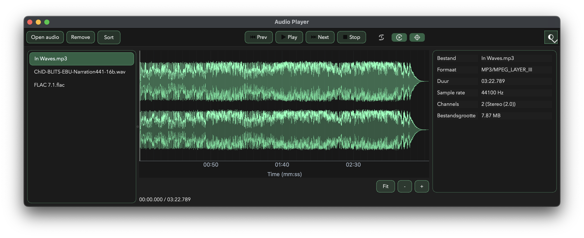
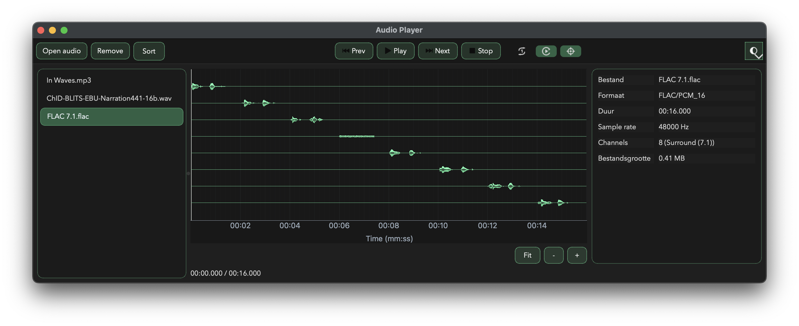
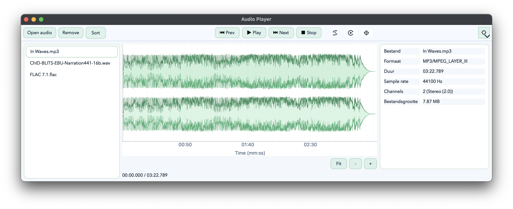
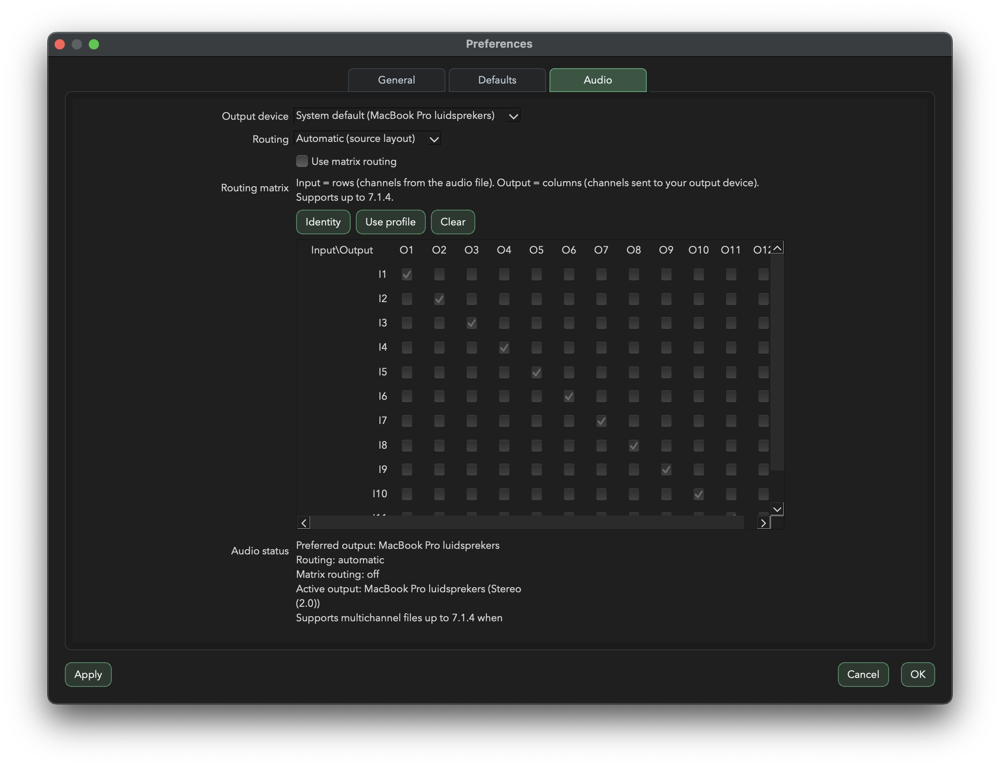

# Audio Player

Fast, visual, and routing-focused desktop playback for creators and audio professionals.

## Why this player

- Large, responsive waveform view for accurate navigation
- Smooth seeking with live playhead tracking
- Powerful channel routing with matrix control up to 7.1.4 (12 channels)
- Built for long sessions with multi-file playlists and fast switching

## Waveform-first experience

- Progressive waveform loading with background preloading and caching
- Full-track **Fit** view on selection
- Click or drag anywhere in the waveform to seek instantly
- Zoom in/out for precision editing-style navigation
- Combined waveform or separate per-channel waveform view

## Advanced audio routing

- Select your output device directly in the app
- Route input channels to output channels via a routing matrix
- Works with stereo, surround, and immersive layouts
- Supports channel layouts up to **7.1.4 (12 channels)**

## Supported file formats

- WAV / WAVE
- FLAC
- OGG
- AIFF / AIF
- MP3
- M4A
- AAC
- WMA

Note: playback support for some compressed formats can depend on the OS multimedia backend.

## Playlist and playback controls

- Open one or multiple files
- Drag-and-drop files into the playlist
- Reorder and sort tracks
- Previous, play/pause, next, and stop controls
- Repeat modes: off, one, all

## Screenshots

### Multichannel waveform (dark theme)

### Stereo waveform (dark theme)

### Stereo waveform (light theme)

### Audio routing matrix

