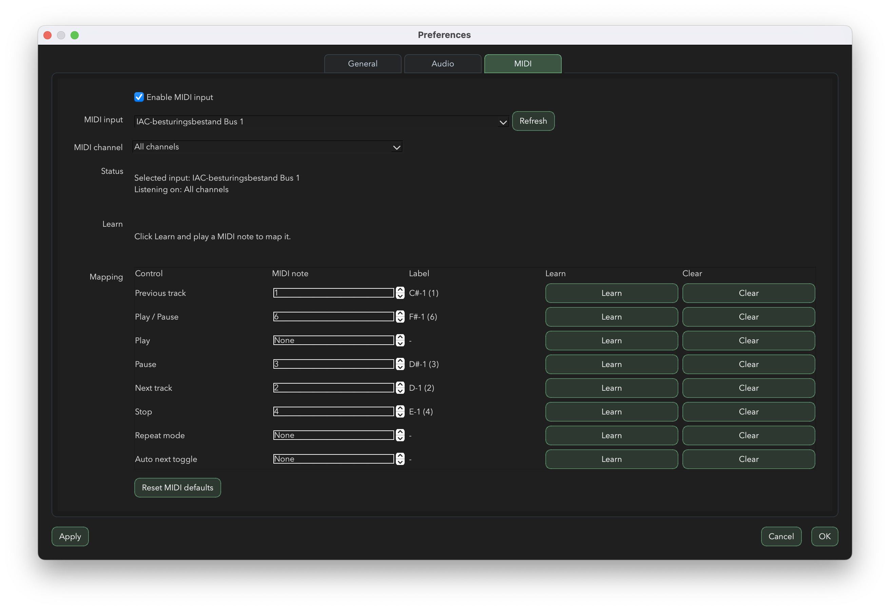

# Audio Player

A fast, modern desktop audio player focused on waveform visibility, accurate navigation, and multichannel playback.

[Download the latest macOS DMG](https://github.com/clevrthings/AudioPlayer/releases/latest)

Current version: **0.1.0**

## Core features

- Real-time waveform playback with smooth playhead tracking
- Progressive waveform loading and waveform caching
- Combined waveform view or split-per-channel view
- Zoom, fit-to-track, click-to-seek, and drag navigation
- Playlist with drag & drop, reordering, sorting, and quick switching
- Repeat modes (`Off`, `One`, `All`) and auto-next behavior
- MIDI learn + MIDI mapping for transport controls
- Output device selection for playback
- Light and dark themes with accent color customization

## Supported audio formats

- WAV / WAVE
- FLAC
- OGG
- AIFF / AIF
- MP3
- M4A
- AAC
- WMA

Note: support for some compressed formats depends on the macOS multimedia backend.

## MIDI control

MIDI can be configured in **Preferences > MIDI**:

- Enable/disable MIDI input
- Select MIDI input device
- Listen on **All channels** or a specific MIDI channel (`1-16`)
- Map controls manually or with **Learn**
- Reset MIDI mappings to defaults

Available mappings:

- Previous track
- Play / Pause (toggle)
- Play
- Pause
- Next track
- Stop
- Repeat mode
- Auto next toggle

## Screenshots

### Multichannel waveform (dark)

### Stereo waveform (light)

### MIDI mapping in Preferences

---

Support the project: https://buymeacoffee.com/clevrthings
